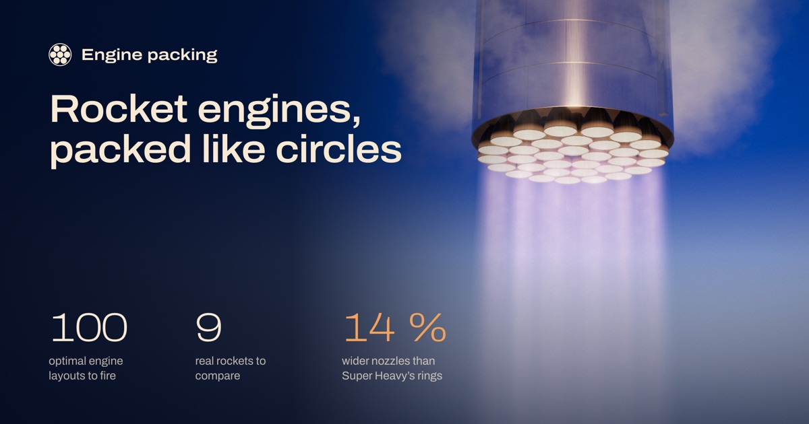

# Engine packing

**Live: https://engine-packing.vercel.app**

What would a rocket booster look like if its engines were laid out by the
mathematically densest way to pack *n* equal circles inside a circle?



Scrub through every best-known packing from 1 to 100 circles and see each one
as a cluster of rocket engines under a 9 m stainless steel booster. Fire them,
orbit around, and check whether the layout is balanced. Shut engines down to
watch the thrust centre move and the rest gimbal to compensate, or light them
one at a time from cold.

## What it shows

- **The packing.** Coordinates come from Eckard Specht's
  [Packomania](http://www.packomania.com/) tables of best-known packings of
  equal circles in a circle. Packings for n ≤ 14 and n = 19 are proven optimal
  ([Wikipedia](https://en.wikipedia.org/wiki/Circle_packing_in_a_circle)). The
  rest are the best known.
- **Nozzle size and fill.** Engines fill an 8.5 m circle inside the 9 m skirt,
  so the nozzle exit diameter is `2 · r · 4.25 m`.
- **Symmetry.** The rotational order and mirror axes, worked out from the
  coordinates. Mirror axes are drawn as dashed lines on the plan.
- **Balance.** The thrust centre is the mean engine position, assuming equal
  thrust per engine. Any offset from the axis has to be cancelled by gimbaling.
  The angle shown assumes the centre of mass is 40 m above the engines.
- **Rattlers.** Many optimal packings have loose circles that the others don't
  lock in place. Where they sit moves the thrust centre, so they're flagged.
- **Real rockets.** A list of real first stages jumps to their engine count.
  Where a rocket's pattern differs from the optimal packing, a switch shows it
  in the same engine bay, with engines sized to the largest that fit the
  pattern, so you can compare like with like:

  | Rocket        | Engines | Pattern                                    | Optimal fits nozzles |
  | ------------- | ------: | ------------------------------------------ | -------------------: |
  | Saturn V      |       5 | 4 gimbaled around 1 fixed                  |           11 % wider |
  | Saturn I / IB |       8 | inner square of 4, outer square turned 45° |           57 % wider |
  | Falcon 9 v1.0 |       9 | 3 × 3 grid                                 |            6 % wider |
  | N1            |      30 | 24 around the rim, 6 inside (approximated) |           40 % wider |
  | Super Heavy   |      33 | 3 + 10 + 20 rings (approximated)           |           14 % wider |

  Some rockets already fly the optimal pattern: Proton (a ring of 6), New
  Glenn (6 around 1), and Falcon 9's Octaweb and Electron (8 around 1).

  Sources: [S-IC](https://en.wikipedia.org/wiki/S-IC),
  [S-I](https://en.wikipedia.org/wiki/S-I) (ring radii from NASA's stage
  documentation), [Falcon 9 v1.0](https://en.wikipedia.org/wiki/Falcon_9_v1.0),
  [Falcon 9 v1.1 / Octaweb](https://en.wikipedia.org/wiki/Falcon_9_v1.1),
  [Rutherford](https://en.wikipedia.org/wiki/Rutherford_(rocket_engine)),
  [New Glenn boosters](https://en.wikipedia.org/wiki/List_of_New_Glenn_boosters),
  [Proton first stage](https://russianspaceweb.com/proton_stage1.html),
  [N1 Block A](https://russianspaceweb.com/n1_a.html). The N1's ring radii and
  Super Heavy's inner ring radii aren't published there, so those are
  estimates.

## Controls

| Action                 | How                                          |
| ---------------------- | -------------------------------------------- |
| Change the engine count | Drag the ruler, or press ← / →               |
| Fire or shut down      | The Fire button, or Space                    |
| Orbit and zoom         | Drag and scroll (pinch on touch)             |
| Turn one engine on/off | Click it in 3D or on the plan                |
| Fire all engines       | The Fire all button, or A                    |
| Jump to a layout       | Link to `#n` or `#n/rocket`, e.g. `/#30/n1`  |
| Jump to a real rocket  | The Real rockets list (Rockets on phones)    |

## Development

```sh
npm install
npm run dev      # http://localhost:5173
npm run build    # type-check and build to dist/
```

The packing table in `src/data/packings.json` is generated from Packomania:

```sh
npm run data -- 100   # fetches cci1..cci100 into scripts/.cache, then rebuilds the JSON
```

The social card (`public/og.jpg`) is composed from `scripts/og/og.html`; the
comment at the top of that file explains how to regenerate it.

The script works out contacts, rattlers (circles whose contacts don't pin them
in place, removed iteratively), symmetry, and the thrust centre at full
precision. Its rattler count reproduces the list of rigid packings on Wikipedia
(n = 1–7, 10–19, 22, 23, 27, 30, 31, 33, 37, 61, 91).

## How it's built

- [three.js](https://threejs.org/) with WebGL 2, Vite and TypeScript. No
  framework.
- Engines are instanced. Nozzle interiors glow through a patched
  `MeshStandardMaterial`.
- Each plume is a ray-marched volume inside an instanced cone: streaky
  turbulence from a tileable noise texture, a rose core with shock diamonds near
  the exit, and a lilac envelope downstream. A wide, faint column stands in for
  the merged exhaust.
- Steam and ground clouds are depth-sorted billboard particles, lit by the low
  sun and the plumes.
- Bloom, ACES tone mapping, vignette and grain finish the frame. Resolution
  drops automatically on slow GPUs.
- The rumble is synthesised in Web Audio from filtered noise.

Type is [Archivo](https://fonts.google.com/specimen/Archivo) (variable width).
